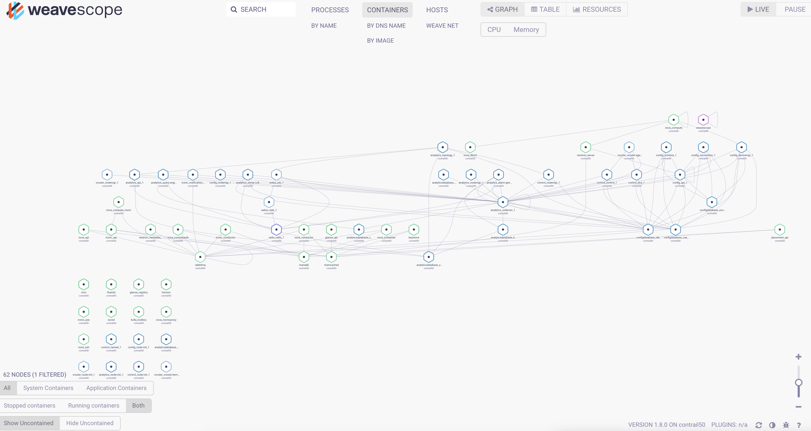
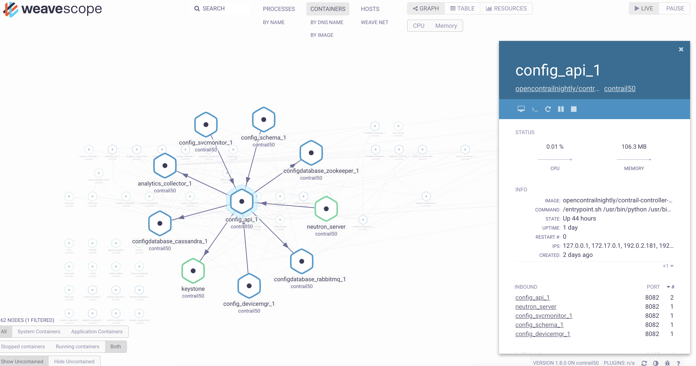
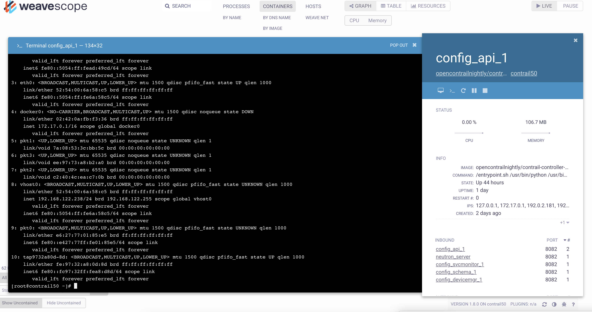

## Steps to deploy all-in-one Contrail + Kolla Ocata OpenStack

1. Bring up a Centos 7.4 VM with 4 vCPU, 32 GB of RAM and 100 GB of disk
2. VM will have 2 NICs, eth0, eth1 configured with static IP.
2. Modify ifcfg-eth0, ifcfg-eth1 under /etc/sysconfig/network-scripts similiar to below
```
TYPE=Ethernet
BOOTPROTO=static
NAME=eth0
DEVICE=eth0
ONBOOT=yes
NM_CONTROLLED=no
USERCTL=no
IPADDR=192.168.122.238
PREFIX=24
GATEWAY=192.168.122.1
```
```
TYPE=Ethernet
BOOTPROTO=static
NAME=eth1
DEVICE=eth1
ONBOOT=yes
NM_CONTROLLED=no
USERCTL=no
IPADDR=192.0.2.181
PREFIX=24
```
3. Remove file /etc/sysconfig/network-scripts/ifcfg-Wired_connection_1 if it exists
4. Make sure internet is accessible via interface eth0
5. Interface eth1 is not been used currently, but make sure its UP and configured
6. Install required packages
```
yum install -y epel-release
yum install -y git ansible net-tools
```
7. Clone contrail-ansible-deployer
```
cd
git clone http://github.com/Juniper/contrail-ansible-deployer
cd contrail-ansible-deployer
```
8. Copy [instances.yaml](https://github.com/urao/tungsten-fabric/blob/master/tungsten_50_deploy/all-in-one-os/instances.yaml) into config/ folder
9. Modify ssh_pwd, ip, contrail_api_interface_address, keystone_admin_password, CONTROL_DATA_NET_LIST, CONTROLLER_NODES, VROUTER_GATEWAY in the instances.yaml file copied from the previous step
10. Install Contrail and Kolla requirements
```
cd contrail-ansible-deployer
ansible-playbook -i inventory/ playbooks/configure_instances.yml 
```
11. Verify if the requirements  was successful.
```
192.168.122.238            : ok=31   changed=22   unreachable=0    failed=0   
localhost                  : ok=10   changed=2    unreachable=0    failed=0   
```
12. Deploy Contrail and Kolla containers
```
cd contrail-ansible-deployer
ansible-playbook -i inventory/ -e orchestrator=openstack playbooks/install_contrail.yml
```
13. Verify if the deployment  was successful.
```
192.168.122.238            : ok=414  changed=200  unreachable=0    failed=0   
localhost                  : ok=7    changed=2    unreachable=0    failed=0   
```
14. Verify if 56 containers are UP and running
```
[root@contrail50 contrail-ansible-deployer]# docker ps | awk '{print $1}' | wc -l
56
```
## Access to Horizon console

1. Get the admin user password
```
sudo grep keystone_admin_password /root/contrail-kolla-ansible/etc/kolla/passwords.yml
```
2. Browse to the IP http://<VM_IP_ADDRESS> and login with the user "admin" and the password from the previous step


## Provision Weave Scope

1. Follow the below instructions to bring up Weave Scope
```
sudo curl -L git.io/scope -o /usr/local/bin/scope
sudo chmod a+x /usr/local/bin/scope
scope launch
```

2. Now you should be able to connect to the UI using http://<HOST_IP>:4040

3. The UI is totally self-explanatory. There are multiple filters that filters the components based on the scope required.

4. Containers view


5. Container detailed view


6. Connecting to a container



## Reference
[Contrail Wiki Link](https://github.com/Juniper/contrail-ansible-deployer/wiki/Contrail-with-Kolla-Ocata)
