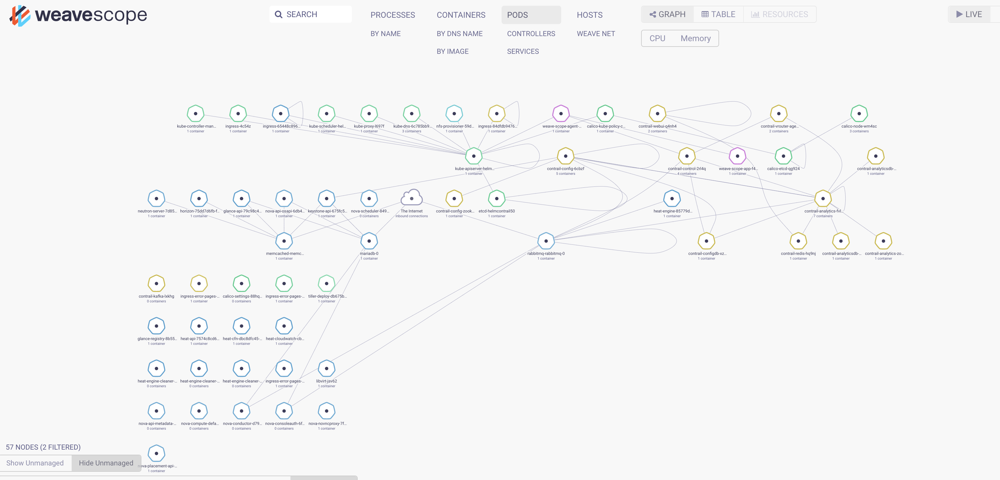
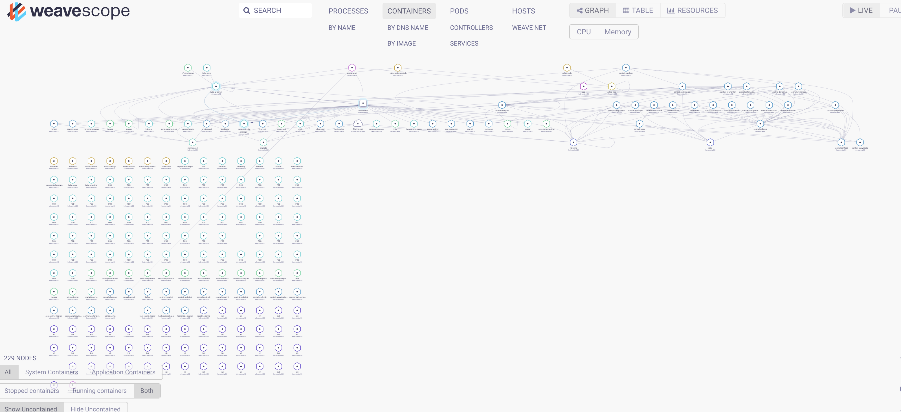
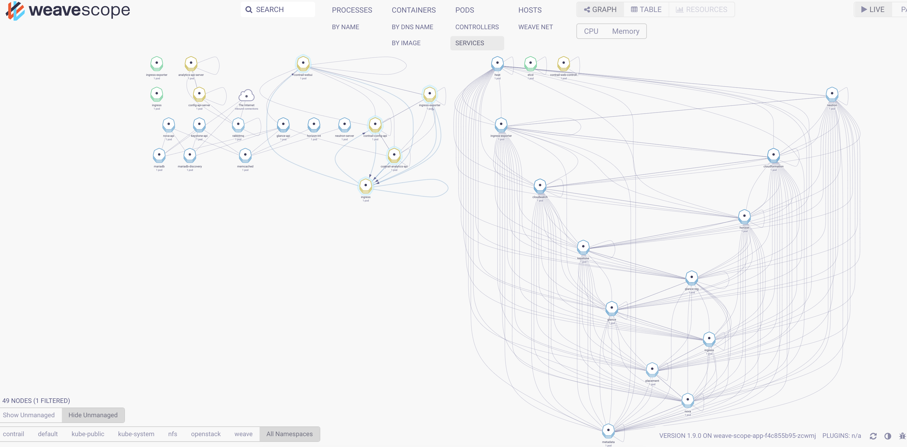
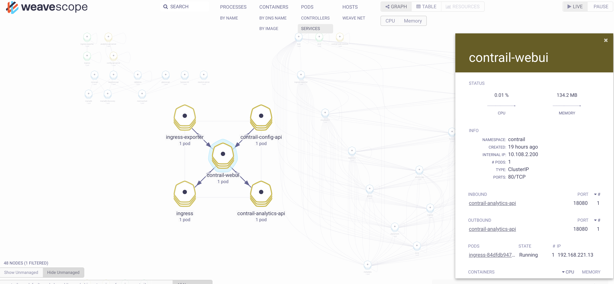
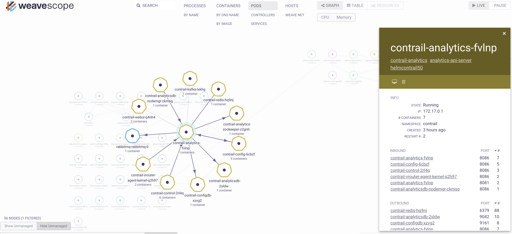
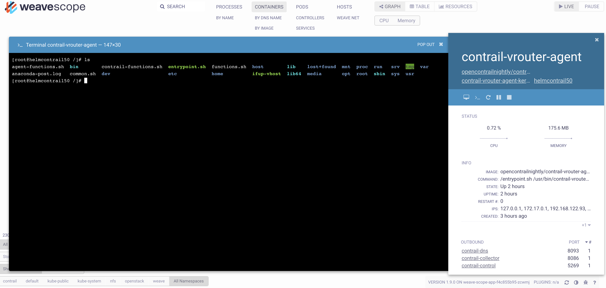

## Steps to deploy all-in-one Contrail + OpenStack using Helm Deployer

1. Bring up a Ubuntu 16.04.3 VM on a KVM Hypervisor with 4 vCPU, 32 GB of RAM and 300 GB of disk
2. VM will have 1 NIC, eth0 configured with Static/DHCP IP.
3. Make sure internet is accessible via interface eth0
4. Install required packages
```
apt-get install -y git ntp ntpdate
```
5. Clone contrail-ansible-deployer
```
mkdir -p git
cd git
git clone https://github.com/Juniper/openstack-helm.git
git clone https://github.com/Juniper/openstack-helm-infra.git
git clone https://github.com/Juniper/contrail-helm-deployer.git
```
6. Configure NTP servers and restart the service
```
systemctl restart ntp
systemctl status ntp
``` 
9. Set ENV variables, based on your configuration
```
export BASE_DIR=$HOME/git
export OSH_PATH=${BASE_DIR}/openstack-helm
export OSH_INFRA_PATH=${BASE_DIR}/openstack-helm-infra
export CHD_PATH=${BASE_DIR}/contrail-helm-deployer
export CONTRAIL_REGISTRY=docker.io/opencontrailnightly
export CONTAINER_TAG=latest
export VROUTER_GATEWAY=192.168.122.1
export CONTROL_NODES=192.168.122.93
export CONTROL_DATA_NET_LIST=192.168.122.0/24
export VROUTER_INTERFACE=ens3
```
10. Install required packages and k8s
```
cd ${OSH_PATH}
./tools/deployment/developer/common/001-install-packages-opencontrail.sh
./tools/deployment/developer/common/010-deploy-k8s.sh
```
11. Verify if the requirements  was successful.
```
PLAY RECAP *********************************************************************************************
local                      : ok=19   changed=13   unreachable=0    failed=0
```
12. Default Contrail UI and OpenStack password is set default to 'password', if you want to modify, change in the below file
```
cd ${OSH_PATH}
./tools/deployment/developer/common/020-setup-client.sh
```
13. Install OpenStack and HEAT client
```
cd ${OSH_PATH}
./tools/deployment/developer/common/020-setup-client.sh
```
14. Deploy OpenStack-Helm 
```
./tools/deployment/developer/nfs/031-ingress-opencontrail.sh
./tools/deployment/developer/nfs/040-nfs-provisioner.sh
./tools/deployment/developer/nfs/050-mariadb.sh
./tools/deployment/developer/nfs/060-rabbitmq.sh
./tools/deployment/developer/nfs/070-memcached.sh
./tools/deployment/developer/nfs/080-keystone.sh
./tools/deployment/developer/nfs/100-horizon.sh
./tools/deployment/developer/nfs/120-glance.sh
./tools/deployment/developer/nfs/151-libvirt-opencontrail.sh
./tools/deployment/developer/nfs/161-compute-kit-opencontrail.sh
```
15. Deploy Contrail-Helm 
```
cd $CHD_PATH
make
kubectl label node opencontrail.org/controller=enabled --all
kubectl label node opencontrail.org/vrouter-kernel=enabled --all
kubectl replace -f ${CHD_PATH}/rbac/cluster-admin.yaml

tee /tmp/contrai.yaml << EOF
global:
  # section to configure images for all containers
  images:
    tags:
      kafka: "${CONTRAIL_REGISTRY}/contrail-external-kafka:${CONTAINER_TAG}"
      cassandra: "${CONTRAIL_REGISTRY}/contrail-external-cassandra:${CONTAINER_TAG}"
      redis: "redis:4.0.2"
      zookeeper: "${CONTRAIL_REGISTRY}/contrail-external-zookeeper:${CONTAINER_TAG}"
      contrail_control: "${CONTRAIL_REGISTRY}/contrail-controller-control-control:${CONTAINER_TAG}"
      control_dns: "${CONTRAIL_REGISTRY}/contrail-controller-control-dns:${CONTAINER_TAG}"
      control_named: "${CONTRAIL_REGISTRY}/contrail-controller-control-named:${CONTAINER_TAG}"
      config_api: "${CONTRAIL_REGISTRY}/contrail-controller-config-api:${CONTAINER_TAG}"
      config_devicemgr: "${CONTRAIL_REGISTRY}/contrail-controller-config-devicemgr:${CONTAINER_TAG}"
      config_schema_transformer: "${CONTRAIL_REGISTRY}/contrail-controller-config-schema:${CONTAINER_TAG}"
      config_svcmonitor: "${CONTRAIL_REGISTRY}/contrail-controller-config-svcmonitor:${CONTAINER_TAG}"
      webui_middleware: "${CONTRAIL_REGISTRY}/contrail-controller-webui-job:${CONTAINER_TAG}"
      webui: "${CONTRAIL_REGISTRY}/contrail-controller-webui-web:${CONTAINER_TAG}"
      analytics_api: "${CONTRAIL_REGISTRY}/contrail-analytics-api:${CONTAINER_TAG}"
      contrail_collector: "${CONTRAIL_REGISTRY}/contrail-analytics-collector:${CONTAINER_TAG}"
      analytics_alarm_gen: "${CONTRAIL_REGISTRY}/contrail-analytics-alarm-gen:${CONTAINER_TAG}"
      analytics_query_engine: "${CONTRAIL_REGISTRY}/contrail-analytics-query-engine:${CONTAINER_TAG}"
      analytics_snmp_collector: "${CONTRAIL_REGISTRY}/contrail-analytics-snmp-collector:${CONTAINER_TAG}"
      contrail_topology: "${CONTRAIL_REGISTRY}/contrail-analytics-topology:${CONTAINER_TAG}"
      build_driver_init: "${CONTRAIL_REGISTRY}/contrail-vrouter-kernel-build-init:${CONTAINER_TAG}"
      vrouter_agent: "${CONTRAIL_REGISTRY}/contrail-vrouter-agent:${CONTAINER_TAG}"
      vrouter_init_kernel: "${CONTRAIL_REGISTRY}/contrail-vrouter-kernel-init:${CONTAINER_TAG}"
      vrouter_dpdk: "${CONTRAIL_REGISTRY}/contrail-vrouter-agent-dpdk:${CONTAINER_TAG}"
      vrouter_init_dpdk: "${CONTRAIL_REGISTRY}/contrail-vrouter-kernel-init-dpdk:${CONTAINER_TAG}"
      nodemgr: "${CONTRAIL_REGISTRY}/contrail-nodemgr:${CONTAINER_TAG}"
      contrail_status: "${CONTRAIL_REGISTRY}/contrail-status:${CONTAINER_TAG}"
      node_init: "${CONTRAIL_REGISTRY}/contrail-node-init:${CONTAINER_TAG}"
      dep_check: quay.io/stackanetes/kubernetes-entrypoint:v0.2.1
    imagePullPolicy: "IfNotPresent"


  # contrail_env section for all containers
  contrail_env:
    CONTROLLER_NODES: ${CONTROL_NODES}
    LOG_LEVEL: SYS_NOTICE
    CLOUD_ORCHESTRATOR: openstack
    AAA_MODE: cloud-admin
    VROUTER_GATEWAY: ${VROUTER_GATEWAY}
    PHYSICAL_INTERFACE: ${VROUTER_INTERFACE}

  # section of vrouter template for kernel mode
  contrail_env_vrouter_kernel:
    CONTROL_DATA_NET_LIST: ${CONTROL_DATA_NET_LIST}

  node:
    host_os: ubuntu
EOF

helm install --name contrail ${CHD_PATH}/contrail --namespace=contrail --values=/tmp/contrail.yaml
```
15. Deploy HEAT Charts
```
cd ${OSH_PATH}
./tools/deployment/developer/nfs/091-heat-opencontrail.sh
```

## Access to OpenStack Console

```
~# kubectl get svc -n openstack | grep horizon-int
horizon-int           NodePort    10.108.83.192    <none>        80:31000/TCP         1d
http://<HOST_IP>:31000/auth/login/?next=/
```
1. Install OpenStack client packages
```
sudo apt-get install python-pip -y
pip install python-openstackclient

```
2. Create openstackrc file
```
cat > $HOME/openstackrc << EOF
  export OS_USERNAME=admin
  export OS_PASSWORD=password
  export OS_TENANT_NAME=admin
  export OS_AUTH_URL=http://keystone-api.openstack:35357/v3
  export OS_IDENTITY_API_VERSION=3
  export OS_USER_DOMAIN_NAME=${OS_USER_DOMAIN_NAME:-"Default"}
  export OS_PROJECT_DOMAIN_NAME=${OS_PROJECT_DOMAIN_NAME:-"Default"}
EOF
```
3. List of services endpoint list
```
export OS_CLOUD=openstack_helm
source $HOME/openstackrc
openstack service list
openstack image list
```

## Check Contrail Status and Access to Contrail UI

```
contrail-status
https://<HOST_IP>:8143
export OS_CLOUD=openstack_helm
openstack token issue
export TOKEN_ID=<id>
curl -X GET -H "X-Auth-Token: $TOKEN_ID" http://192.168.122.93:8082/virtual-networks | python -mjson.tool
```

## Useful Commands
```
kubectl get pod --all-namespaces -o wide
kubectl get pods -n contrail -o wide
kubectl get pods -n openstack -o wide
kubectl exec -it neutron-server-7d858848fb-2dtvl bash -n openstack

```

## Provision Weave Scope

1. Follow the below instructions to bring up Weave Scope
```
https://www.weave.works/docs/scope/latest/installing/#k8s
```

2. Now you should be able to connect to the UI using http://<HOST_IP>:<PORT>

3. The UI is totally self-explanatory. There are multiple filters that filters the components based on the scope required.

4. Pods view


5. Container view


6. Services view


7. Service detail view


8. Pod detail view


9. Connecting to a Pod or Container



## Reference
[Contrail Wiki Link](https://github.com/Juniper/contrail-helm-deployer/blob/master/doc/contrail-osh-aio-install.md)

[Kubectl Cheat Sheet](https://kubernetes.io/docs/reference/kubectl/cheatsheet/)
